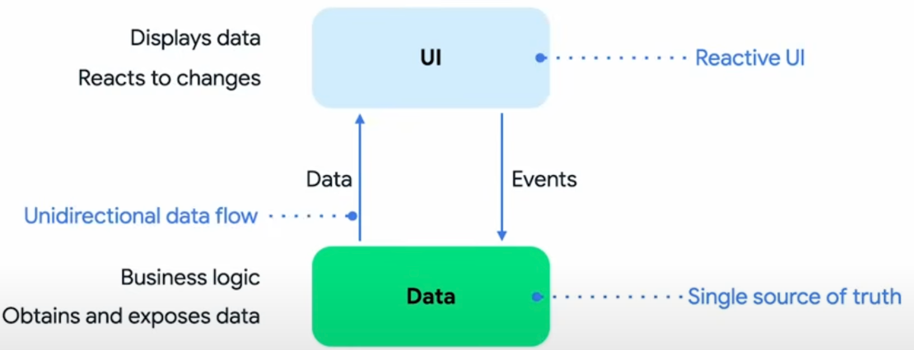
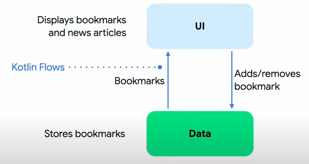

# Architecture Learning Journey

* goal
  * learn Android app architecture's
    * layers,
    * key classes
    * interactions between layers -- & -- classes

## App architecture's goals & requirements

* requirements
  * follow the [official architecture guidance](https://developer.android.com/jetpack/guide)
* goal
  * easy to understand
  * support MULTIPLE developers / work | SAME codebase
  * facilitate local & instrumented tests (| developer’s machine & CI)
  * minimize build times

## Architecture overview

* == 3 layers
  * [data layer](https://developer.android.com/jetpack/guide/data-layer),
  * [domain layer](https://developer.android.com/jetpack/guide/domain-layer)
  * [UI layer](https://developer.android.com/jetpack/guide/ui-layer)

* Android architecture 👀!= OTHER architectures (_Example:_ "Clean Architecture")👀
  * see [More discussion here](https://github.com/android/nowinandroid/discussions/1273)
  * 💡reactive programming model / [unidirectional data flow](https://developer.android.com/jetpack/guide/ui-layer#udf)💡
    * Reason: 🧠
      * UI -- reacts to -- changes == Reactive UI
    * -> Data layer == 1! source of truth

    
  * 👀KEY concepts 👀
    * HIGHER layers -- react to -- changes | lower layers
    * Events -- flow -- down
    * Data -- flows -- up
      * -- via -- [Kotlin Flows](https://developer.android.com/kotlin/flow)

    

### Example: Display news | For You screen

* | first run of the app
  * try to load a list of news resources -- from a -- remote server 
    * if `prod` build flavor is selected -> `demo` builds -- will use -- local data
* | ALREADY loaded
  * list of resources -- are shown, based on the -- interests / they chose

* steps -- to display the -- resources

  

* easiest way to find the associated code
  * load the project | Android Studio
  * search for the text | Code column (handy shortcut: tap <kbd>⇧ SHIFT</kbd> twice)

* TODO:
<table>
  <tr>
   <td><strong>Step</strong>
   </td>
   <td><strong>Description</strong>
   </td>
   <td><strong>Code </strong>
   </td>
  </tr>
  <tr>
   <td>1
   </td>
   <td>| app startup, a <a href="https://developer.android.com/topic/libraries/architecture/workmanager">WorkManager</a> job -- sync -- ALL repositories  enqueued
   </td>
   <td><code>Sync.initialize</code>
   </td>
  </tr>
  <tr>
   <td>2
   </td>
   <td><code>ForYouViewModel</code> calls <code>GetUserNewsResourcesUseCase</code> -- to obtain a -- stream of NEW resources + their bookmarked/saved state   FIRST items -- will be emitted by -- user & news repositories    | waiting, feed state -- is set to -- <code>Loading</code>
   </td>
   <td><code>NewsFeedUiState.Loading</code>
   </td>
  </tr>
  <tr>
   <td>3
   </td>
   <td>user data repository -- obtains a -- stream of <code>UserData</code> objects -- from a -- local data source / backed by Proto DataStore
   </td>
   <td><code>NiaPreferencesDataSource.userData</code>
   </td>
  </tr>
  <tr>
   <td>4
   </td>
   <td>WorkManager executes the sync job which calls <code>OfflineFirstNewsRepository</code> to start synchronizing data with the remote data source.
   </td>
   <td><code>SyncWorker.doWork</code>
   </td>
  </tr>
  <tr>
   <td>5
   </td>
   <td><code>OfflineFirstNewsRepository</code> calls <code>RetrofitNiaNetwork</code> to execute the actual API request using <a href="https://square.github.io/retrofit/">Retrofit</a>.
   </td>
   <td><code>OfflineFirstNewsRepository.syncWith</code>
   </td>
  </tr>
  <tr>
   <td>6
   </td>
   <td><code>RetrofitNiaNetwork</code> calls the REST API on the remote server.
   </td>
   <td><code>RetrofitNiaNetwork.getNewsResources</code>
   </td>
  </tr>
  <tr>
   <td>7
   </td>
   <td><code>RetrofitNiaNetwork</code> receives the network response from the remote server.
   </td>
   <td><code>RetrofitNiaNetwork.getNewsResources</code>
   </td>
  </tr>
  <tr>
   <td>8
   </td>
   <td><code>OfflineFirstNewsRepository</code> syncs the remote data with <code>NewsResourceDao</code> by inserting, updating or deleting data in a local <a href="https://developer.android.com/training/data-storage/room">Room database</a>.
   </td>
   <td><code>OfflineFirstNewsRepository.syncWith</code>
   </td>
  </tr>
  <tr>
   <td>9
   </td>
   <td>When data changes in <code>NewsResourceDao</code> it is emitted into the news resources data stream (which is a <a href="https://developer.android.com/kotlin/flow">Flow</a>).
   </td>
   <td><code>NewsResourceDao.getNewsResources</code>
   </td>
  </tr>
  <tr>
   <td>10
   </td>
   <td><code>OfflineFirstNewsRepository</code> acts as an <a href="https://developer.android.com/kotlin/flow#modify">intermediate operator</a> on this stream, transforming the incoming <code>PopulatedNewsResource</code> (a database model, internal to the data layer) to the public <code>NewsResource</code> model which is consumed by other layers.
   </td>
   <td><code>OfflineFirstNewsRepository.getNewsResources</code>
   </td>
  </tr>
  <tr>
   <td>11
   </td>
   <td><code>GetUserNewsResourcesUseCase</code> combines the list of news resources with the user data to emit a list of <code>UserNewsResource</code>s.  
   </td>
   <td><code>GetUserNewsResourcesUseCase.invoke</code>
   </td>
  </tr>
  <tr>
   <td>12
   </td>
   <td>When <code>ForYouViewModel</code> receives the saveable news resources it updates the feed state to <code>Success</code>.

  <code>ForYouScreen</code> then uses the saveable news resources in the state to render the screen.
   </td>
   <td>Search for instances of <code>NewsFeedUiState.Success</code>
   </td>
  </tr>
</table>

## Data layer

* == business logic
* obtain & expose data /
  * 👀source of truth for ALL data | app 👀
* -- implemented as an -- offline-first source of app data & business logic

* OWN models / EACH repository
  * _Example:_ `Topic` model / `TopicsRepository`,  `NewsResource` model / `NewsRepository`

* Repositories
  * == public API -- for -- OTHER layers
    * offer >=1 methods -- for -- 
      * reading data
      * writing data 
  * provide
    * ONLY way -- to access the -- app data

### Reading data

* Data -- is exposed as -- data streams
  * == EACH client of the repository -- MUST be prepared to react to -- data changes 
  * != snapshot (e.g. `getModel`)
    * Reason: 🧠NO guarantee that it will still be valid | time / it is used 🧠

* Reads
  * performed -- from -- local storage (== source of truth)
    * ERRORS
      * NOT expected | reading -- from -- `Repository` instances
      * MAY occur | trying to reconcile local storage's data -- with -- remote sources
        * check [data synchronization](#data-synchronization)
  * _Example:_
    * if you subscribe to `TopicsRepository::getTopics` flow / emits `List<Topic>`
    * if the list of topics changes (_Example:_ NEW topic is added) -> the updated `List<Topic>` is emitted | stream

### Writing data

* TODO:
* To write data, the repository provides suspend functions. 
It is up to the caller to ensure that their execution is suitably scoped.

_Example: Follow a topic_

Simply call `UserDataRepository.toggleFollowedTopicId` with the ID of the topic the user wishes to follow and `followed=true` to indicate that the topic should be followed (use `false` to unfollow a topic).

### Data sources

A repository may depend on one or more data sources. For example, the `OfflineFirstTopicsRepository` depends on the following data sources:

<table>
  <tr>
   <td><strong>Name</strong>
   </td>
   <td><strong>Backed by</strong>
   </td>
   <td><strong>Purpose</strong>
   </td>
  </tr>
  <tr>
   <td>TopicsDao
   </td>
   <td><a href="https://developer.android.com/training/data-storage/room">Room/SQLite</a>
   </td>
   <td>Persistent relational data associated with Topics
   </td>
  </tr>
  <tr>
   <td>NiaPreferencesDataSource
   </td>
   <td><a href="https://developer.android.com/topic/libraries/architecture/datastore">Proto DataStore</a>
   </td>
   <td>Persistent unstructured data associated with user preferences, specifically which Topics the user is interested in. This is defined and modeled in a .proto file, using the protobuf syntax.
   </td>
  </tr>
  <tr>
   <td>NiaNetworkDataSource
   </td>
   <td>Remote API accessed using Retrofit
   </td>
   <td>Data for topics, provided through REST API endpoints as JSON.
   </td>
  </tr>
</table>

### Data synchronization

Repositories are responsible for reconciling data in local storage with remote sources. Once data is obtained from a remote data source it is immediately written to local storage. The  updated data is emitted from local storage (Room) into the relevant data stream and received by any listening clients.

This approach ensures that the read and write concerns of the app are separate and do not interfere with each other.

In the case of errors during data synchronization, an exponential backoff strategy is employed. This is delegated to `WorkManager` via the `SyncWorker`, an implementation of the `Synchronizer` interface.

See the `OfflineFirstNewsRepository.syncWith` for an example of data synchronization.

## Domain layer
The [domain layer](https://developer.android.com/topic/architecture/domain-layer) contains use cases. These are classes which have a single invocable method (`operator fun invoke`) containing business logic. 

These use cases are used to simplify and remove duplicate logic from ViewModels. They typically combine and transform data from repositories. 

For example, `GetUserNewsResourcesUseCase` combines a stream (implemented using `Flow`) of `NewsResource`s from a `NewsRepository` with a stream of `UserData` objects from a `UserDataRepository` to create a stream of `UserNewsResource`s. This stream is used by various ViewModels to display news resources on screen with their bookmarked state.  

Notably, the domain layer in Now in Android _does not_ (for now) contain any use cases for event handling. Events are handled by the UI layer calling methods on repositories directly.

## UI Layer

* == UI elements + [Android ViewModels](https://developer.android.com/topic/libraries/architecture/viewmodel)
  * UI elements -- are built via -- [Jetpack Compose](https://developer.android.com/jetpack/compose)
* display data

The ViewModels receive streams of data from use cases and repositories, and transforms them into UI state. The UI elements reflect this state, and provide ways for the user to interact with the app. These interactions are passed as events to the ViewModel where they are processed.

### Modeling UI state

UI state is modeled as a sealed hierarchy using interfaces and immutable data classes. State objects are only ever emitted through the transform of data streams. This approach ensures that:

*   the UI state always represents the underlying app data - the app data is the source-of-truth.
*   the UI elements handle all possible states.

**Example: News feed on For You screen**

The feed (a list) of news resources on the For You screen is modeled using `NewsFeedUiState`. This is a sealed interface which creates a hierarchy of two possible states:

*   `Loading` indicates that the data is loading
*   `Success` indicates that the data was loaded successfully. The Success state contains the list of news resources.

The `feedState` is passed to the `ForYouScreen` composable, which handles both of these states.

### Transforming streams into UI state

ViewModels receive streams of data as cold [flows](https://kotlin.github.io/kotlinx.coroutines/kotlinx-coroutines-core/kotlinx.coroutines.flow/-flow/index.html) from one or more use cases or repositories. These are [combined](https://kotlin.github.io/kotlinx.coroutines/kotlinx-coroutines-core/kotlinx.coroutines.flow/combine.html) together, or simply [mapped](https://kotlinlang.org/api/kotlinx.coroutines/kotlinx-coroutines-core/kotlinx.coroutines.flow/map.html), to produce a single flow of UI state. This single flow is then converted to a hot flow using [stateIn](https://kotlin.github.io/kotlinx.coroutines/kotlinx-coroutines-core/kotlinx.coroutines.flow/state-in.html). The conversion to a state flow enables UI elements to read the last known state from the flow.

**Example: Displaying followed topics**

The `InterestsViewModel` exposes `uiState` as a `StateFlow<InterestsUiState>`. This hot flow is created by obtaining the cold flow of `List<FollowableTopic>` provided by `GetFollowableTopicsUseCase`. Each time a new list is emitted, it is converted into an `InterestsUiState.Interests` state which is exposed to the UI.

### Processing user interactions

User actions are communicated from UI elements to ViewModels using regular method invocations. These methods are passed to the UI elements as lambda expressions.

**Example: Following a topic**

The `InterestsScreen` takes a lambda expression named `followTopic` which is supplied from `InterestsViewModel.followTopic`. Each time the user taps on a topic to follow this method is called. The ViewModel then processes this action by informing the user data repository.

## Further reading

[Guide to app architecture](https://developer.android.com/topic/architecture)

[Jetpack Compose](https://developer.android.com/jetpack/compose)
